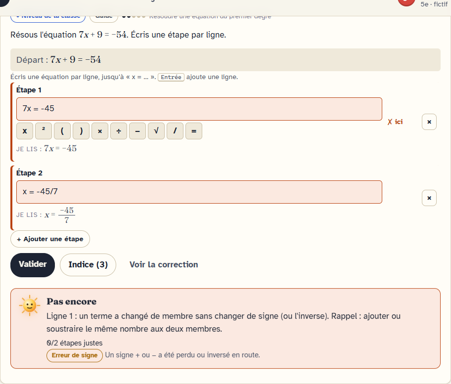
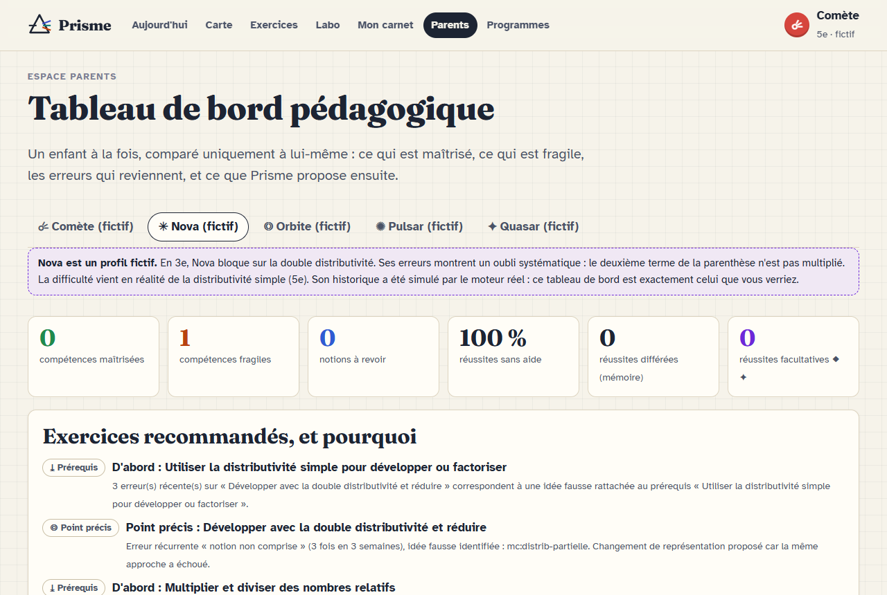
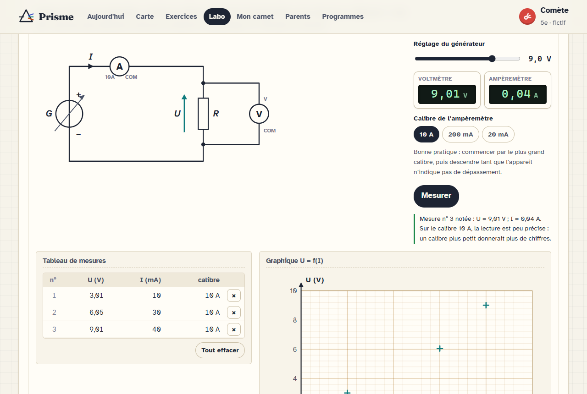

# Prisme — apprendre en manipulant

**Application en ligne : https://wenhuanghuang.github.io/prisme-apprendre/** (installable depuis Chrome ou Edge, fonctionne ensuite hors connexion).

Application éducative en français, du CP à la Terminale, fondée sur la **manipulation** et sur un **moteur adaptatif compétence par compétence** : elle repère précisément ce qui coince (notion, calcul, signe, lecture, méthode, justification, unité…) et propose le bon exercice au bon moment, en expliquant pourquoi, à l'élève comme au parent.

- **Démonstration approfondie** : mathématiques (5e, 4e, début de 3e), physique-chimie (cycle 4), programmation et intelligence artificielle ; échantillons en français et en histoire.
- **Trois parcours séparés** pour chaque notion : niveau de la classe, approfondissement, expert (facultatifs : ils ne font jamais baisser la progression du programme).
- **Peu de QCM** : calculs vérifiés ligne par ligne, expressions, grandeurs avec unités, contre-exemples, réponses multiples, équations à inventer, programmes, frises, droite graduée, repère, rédactions avec critères et validation par un adulte.
- **Vie privée** : pseudo seulement, tout reste sur l'ordinateur (IndexedDB), aucun appel réseau, export / restauration / effacement.
- **PWA** installable dans Chrome ou Edge, utilisable hors connexion.

## Aperçu

| Diagnostic ligne par ligne | Tableau de bord parent | Laboratoire (loi d'Ohm) |
|---|---|---|
|  |  |  |

Autres captures dans [docs/captures/](docs/captures/) (régénérables avec `node tools/screenshots.js`).

## Démarrer

Prérequis : Node.js 20 ou plus. Aucune dépendance pour l'application et les tests ; `npm install` n'est utile que pour les tests dans le navigateur (`playwright-core`, qui utilise Edge ou Chrome déjà installé).

```bash
npm run build
```

```bash
npm start
```

Puis ouvrir http://localhost:10090/. Pour découvrir le diagnostic sans rien saisir : « Charger les profils fictifs » sur l'écran d'accueil, puis l'espace **Parents**.

## Tests

```bash
npm test
```

- `tests/unit/` : moteur d'expressions (virgule décimale, multiplication implicite, équivalences, formes), correcteurs (diagnostic de chaque type d'erreur), langage Tortue, unités.
- `tests/scenarios/` : cinq élèves fictifs rejoués dans le vrai moteur, et changements d'exercice selon les erreurs ou réussites.
- `npm run validate` : valide tous les contenus et **rejoue les réponses types de chaque exercice sur 7 tirages de paramètres**.

## Ajouter du contenu

Les leçons sont des fichiers JSON (`app/content/lessons/`), sans code : voir [docs/FORMAT-CONTENU.md](docs/FORMAT-CONTENU.md) et [docs/WIDGETS.md](docs/WIDGETS.md). `npm run build` valide et régénère l'index et la liste hors connexion.

## Documentation

| Document | Contenu |
|---|---|
| [docs/ARCHITECTURE.md](docs/ARCHITECTURE.md) | analyse des exigences, architecture, flux d'une réponse, sécurité |
| [docs/MOTEUR-ADAPTATIF.md](docs/MOTEUR-ADAPTATIF.md) | diagnostic, modèle de l'élève, recommandations, choix des exercices |
| [docs/MATRICE-PROGRAMMES.md](docs/MATRICE-PROGRAMMES.md) | correspondance programmes officiels 2026-2027 ↔ contenus (générée) |
| [docs/PROFILS-FICTIFS.md](docs/PROFILS-FICTIFS.md) | élèves fictifs : diagnostic, recommandations, exercices choisis (généré par le moteur) |
| [docs/DEMONSTRATION.md](docs/DEMONSTRATION.md) | démonstration guidée (≈ 20 min) en mathématiques et en physique |
| [docs/COMPARAISON.md](docs/COMPARAISON.md) | comparaison avec l'application de référence |
| [docs/ETAT-DU-PROJET.md](docs/ETAT-DU-PROJET.md) | ce qui est terminé, ce qui reste à développer |
| [research/](research/) | recherche documentaire sourcée (programmes, Lumni, analyse de l'application de référence) |

## Installer sur un PC Windows (application locale)

Prérequis : Node.js 20+ et Microsoft Edge (présent sur Windows). Depuis le dossier du projet, créer les raccourcis :

```powershell
powershell -ExecutionPolicy Bypass -File tools\windows\installer-raccourcis.ps1
```

Le raccourci « Prisme » (Bureau et menu Démarrer) démarre le serveur local sur le port 10090 s'il ne tourne pas, vérifie que c'est bien Prisme qui répond, puis ouvre l'application dans sa propre fenêtre Edge. Les données des élèves restent dans Edge, sur ce PC (adresse `http://localhost:10090`) : elles sont distinctes de celles de la version en ligne (utiliser Export / Restauration pour passer de l'une à l'autre).

## Publication

`bash tools/deploy.sh` reconstruit, vérifie que tout est commité, puis publie le dossier `app/` sur la branche `gh-pages` (GitHub Pages).

## Licence

Code sous licence MIT. Les liens vers Lumni, Éduscol, le Bulletin officiel et Légifrance renvoient aux sites d'origine ; aucune vidéo n'est copiée ni republiée.
